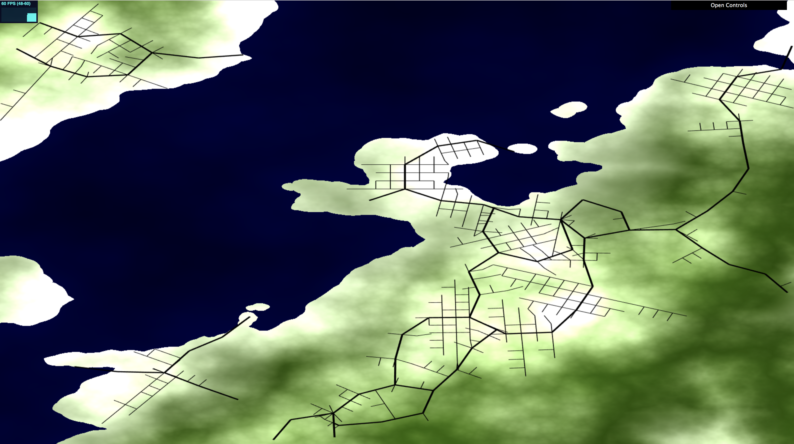
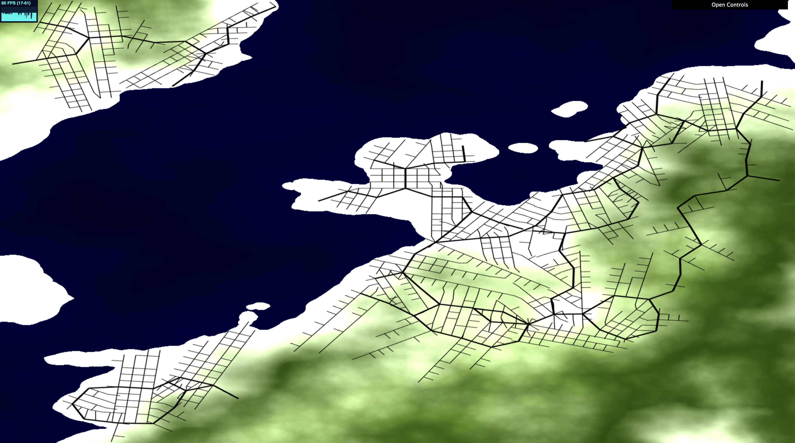
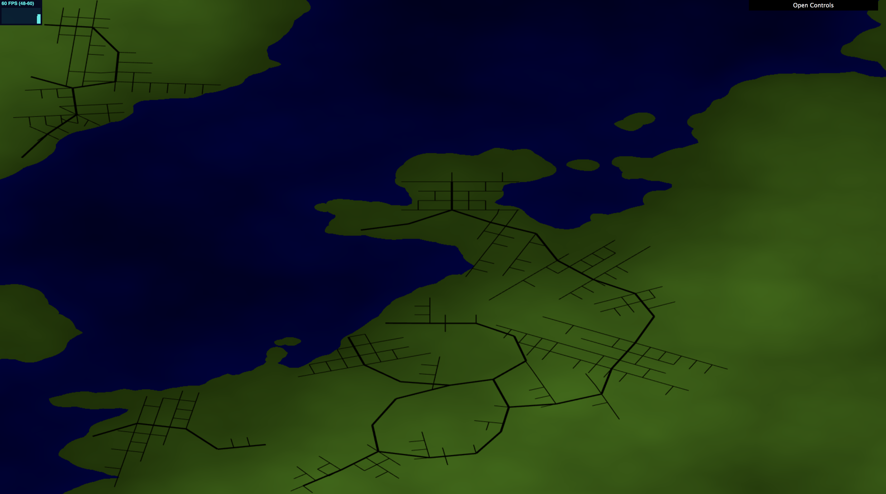
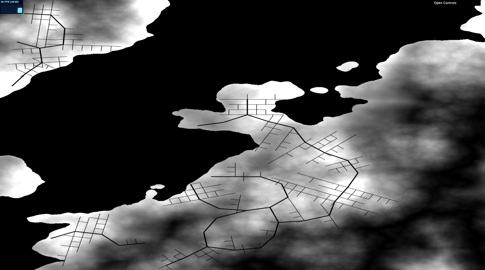
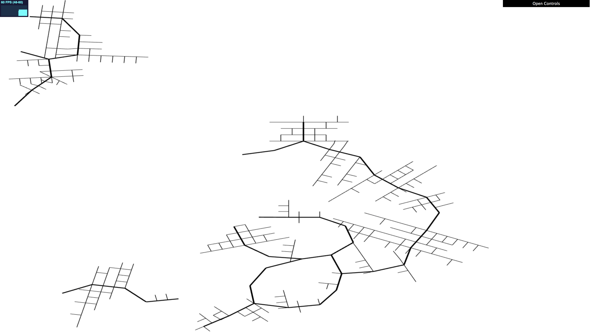
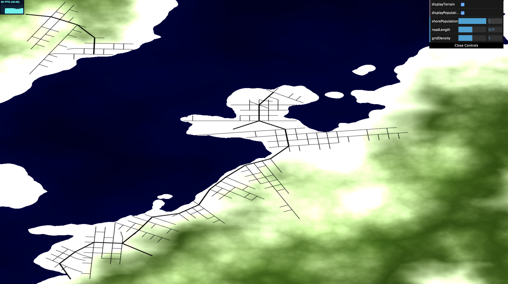
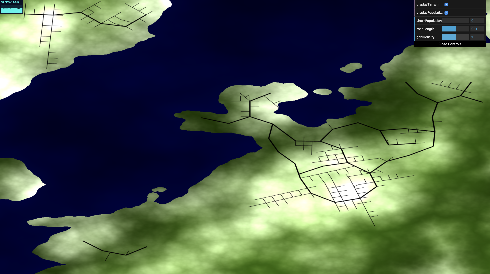

# Grace Gilbert (gracegi): Road Generation

https://gracelgilbert.github.io/hw05-road-generation/

## Resources
- I looked at CIS 460 lecture slides for line segment intersection
- I used the base code for CIS 460 Homework 4 for help with setting up rendering to a texture
- I looked at the following link for help setting up rendering to a texture with WebGL: https://webglfundamentals.org/webgl/lessons/webgl-render-to-texture.html
- I used the following source to help sample from a WebGLTexture: https://developer.mozilla.org/en-US/docs/Web/API/WebGLRenderingContext/readPixels

## Implementation
### Map
I generated the map data in a shader which I render to a texture. I sample from this texture when generating the roads so they grow based map data. I then render this texture to the screen to display. In the texture, the RGB channels represent the terriain color, blue for water and green for land, with lighter values indicating higher terrain. The population density value is stored in the alpha channel. When rendering the texture to the screen, there is a base black screen color. If the user has selected to view the terrain, the RGB value is added to that black color.  If the user has selected to view the population density, the alpha channel value is added to the RGB values of the final screen color, whitening those areas. If neither population nor terrain are dispalayed, the background is set to white so the black roads remain visible.

  Terrain View Only

  Population View Only

  Road View Only

#### Terrain Map
The height map is generated with Worley Noise based FBM with a layer of pure Worley noise on top. If the height value is below 0.53, it is filled with water, and higher terrain is land. I do not incorporate the pure Worley noise layer into the final color, as it created unrealistic cell patterns in the texture, but I included it in the height calculation because it broke up the line between water and land nicely. 
#### Population Map
The population map is generated with Worley Noise based FBM. The value output from the noise function is raised to a power of 1.5 to create brighter, sharper spots of high population. Population is increased by the shoreline. When the terrain is between the land/water cutoff height and a slightly larger height, I use the distance from the shore to linearly interpolate between 0 and a value controlled by the user. This smoothly increases the population close to the shoreline, which caused the roads to tend to branch out following the shore. This is also a realistic effect, as large populations often gather near coasts.

  Maximum shore population density

  Road View Only

### Roads

#### Highway Generation
#### Grid Generation

## Elements to Improve

