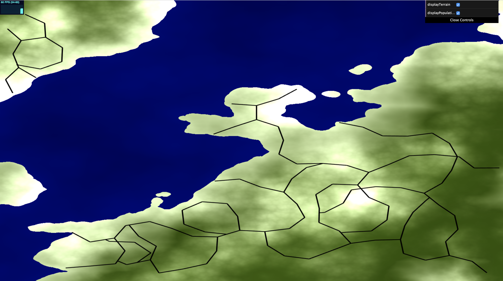
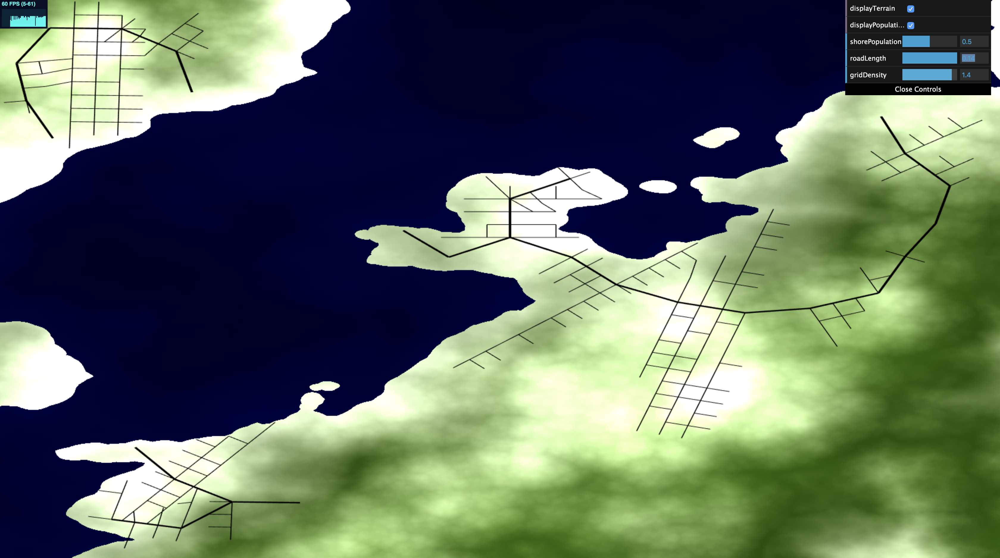
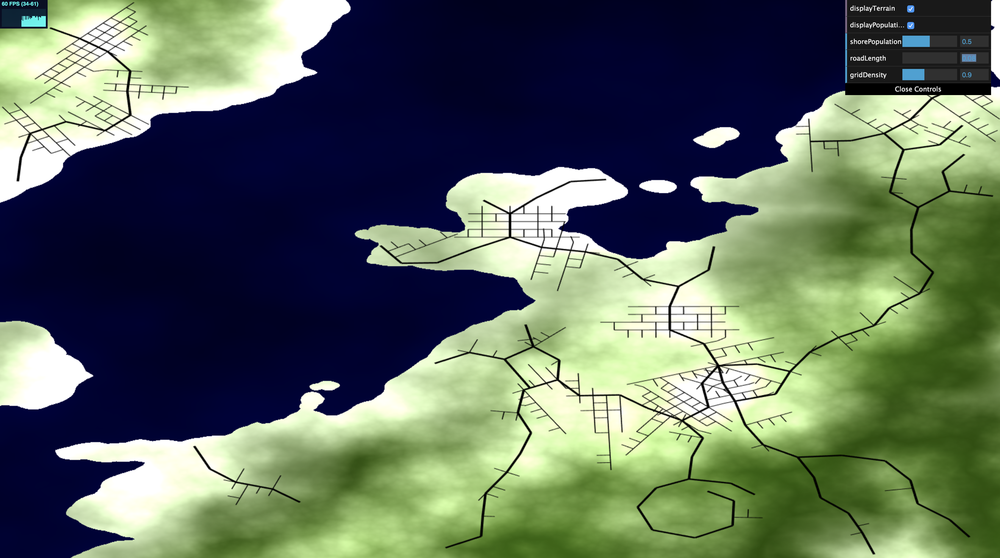
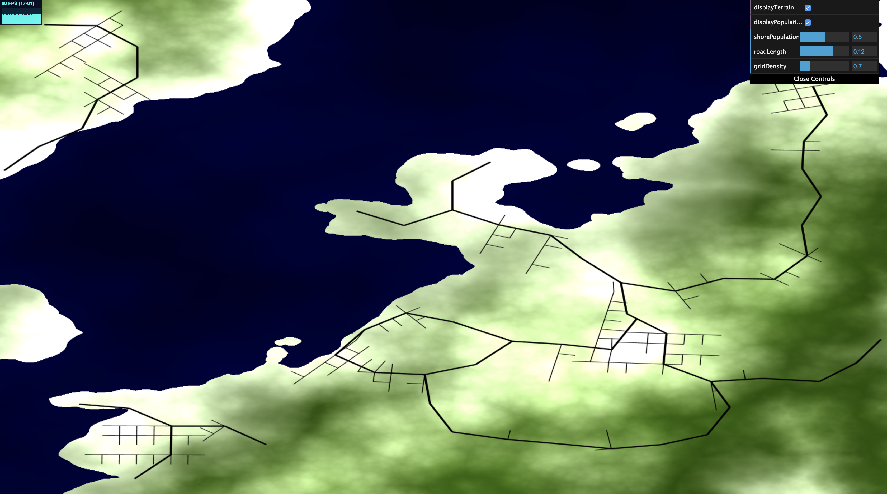
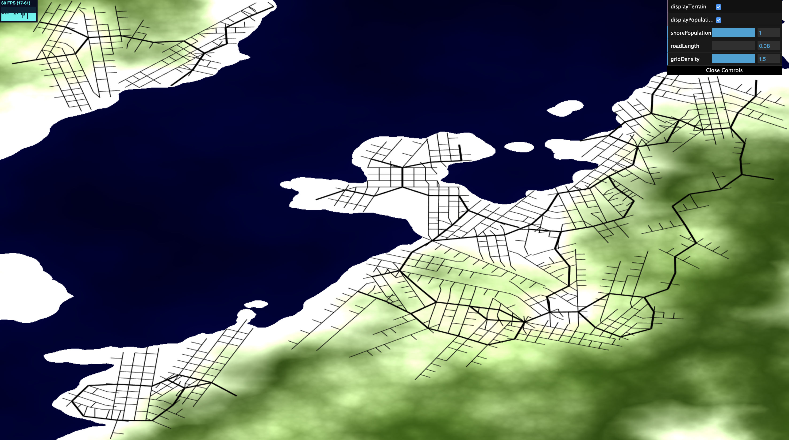

# Grace Gilbert (gracegi): Road Generation

https://gracelgilbert.github.io/hw05-road-generation/

## Resources
- I looked at CIS 460 lecture slides for line segment intersection
- I used the base code for CIS 460 Homework 4 for help with setting up rendering to a texture
- I looked at the following link for help setting up rendering to a texture with WebGL: https://webglfundamentals.org/webgl/lessons/webgl-render-to-texture.html
- I used the following source to help sample from a WebGLTexture: https://developer.mozilla.org/en-US/docs/Web/API/WebGLRenderingContext/readPixels

## Implementation
### Map
I generated the map data in a shader which I render to a texture. I sample from this texture when generating the roads so they grow based map data. I then render this texture to the screen to display. In the texture, the RGB channels represent the terriain color, blue for water and green for land, with lighter values indicating higher terrain. The population density value is stored in the alpha channel. When rendering the texture to the screen, there is a base black screen color. If the user has selected to view the terrain, the RGB value is added to that black color.  If the user has selected to view the population density, the alpha channel value is added to the RGB values of the final screen color, whitening those areas. If neither population nor terrain are dispalayed, the background is set to white so the black roads remain visible.

  Terrain View Only

  Population View Only

  Road View Only

#### Terrain Map
The height map is generated with Worley Noise based FBM with a layer of pure Worley noise on top. If the height value is below 0.53, it is filled with water, and higher terrain is land. I do not incorporate the pure Worley noise layer into the final color, as it created unrealistic cell patterns in the texture, but I included it in the height calculation because it broke up the line between water and land nicely. 
#### Population Map
The population map is generated with Worley Noise based FBM. The value output from the noise function is raised to a power of 1.5 to create brighter, sharper spots of high population. Population is increased by the shoreline. When the terrain is between the land/water cutoff height and a slightly larger height, I use the distance from the shore to linearly interpolate between 0 and a value controlled by the user. This smoothly increases the population close to the shoreline, which caused the roads to tend to branch out following the shore. This is also a realistic effect, as large populations often gather near coasts.

  Maximum shore population density

  No Additional Shore Population

### Roads
I use a pseudo L-System system to generate roads, which functions somewhat like a random walk with rules. The road structure is expanded using a Depth First Search approach. Like in an L-System, turtles are used to keep track of their position and orientation. There are three initial turtles, hard coded to be placed spread out in the map. These are pushed onto a stack of turtles. While this stack of turtles is not empty (or a hard coded cap is reached), a turtle is popped off the stack and becomes the current turtle. This turtle determines the continuation of the path. The rules for this continuation are different for highways and grids, which will be described below. Once the turtle determines where to go next, it places edges in those directions and intersections at the final destiantions. New turtles are positioned at the destinations and oriented along the newly created edges. These turtles are pushed onto the stack so that they can later be popped off to continue branching.

Before an edge is placed, it undergoes multiple tests. The first test is to ensure that the edge does not end under water or off screen.  If it does, the edge is not added and the resulting turtle never gets pushed onto the stack, preventing that branch from continuing.  The next test checks for intersections with other roads using line segment intersection testing. If a road intersects a previously placed road, it gets cut off right where it hits that road. The new turtle is not pushed to the stack so branching ends at the intersection. Finally, if the endpoint of a newly placed road is within a small radius of another intersection, it snaps to that intersection, rotating towards it and adapting its length. Again, the new turtle is not pushed to the stack so branching terminates at the intersection.

#### Highway Generation
Each turtle has a branching number that determines how many branches it splits into. For the highways, if the branching number is 2, it splits into 2 evenly spaced branches with some random offset to be perfectly even branching. If the branching number is 1, the turtle tests three random directions in the general forward direction and chooses the direction that would bring it to the highest population region. As evident in the image below just of highways, this branching method creates road structures that travel towards high population areas. 

The highway length is modifiable by the user, varied slightly with a random value. 

  Long Roads

  Short Roads

#### Grid Generation
The grid generation process occurs for each highway edge. When a grid is generation on a highway edge, it starts at the origin of the edge. A turtle rotates 90 degrees, draws an edge forward, rotates 90 degrees in the opposite direction, and draws another edge forward. Another turtle starts at the intersection of the two previous grid rows, continuing this right angle branching pattern straight out in the direction perpendicular to the base highway road. Once one perpedicular grid section is place, another one is placed further along the initial highway edge, continuing the grid. Each perpendicular section has a 1/3 the length of the highway road, allowing for three grid rows per highway edge. 

The grids extend a maximum of 12 iterations out from the highway road, but also terminates with a probabililty depending on population density. The lower the population density, the earlier the grid extension is likely to terminate. The user can modify the grid density. With higher grid density, even lower population areas will have denser grids. With lower grid density, the high population areas will still have grids, but grids will be sparse in lower population areas. Below are images that demonstrate the affect of population density and grid density:

  Low Grid Density

  High Grid Density, Short Road Length, High Shore Population

## Elements to Improve
- I would like to improve my intersection check. It works the majority of the time, but there are still some edge cases that are not caught, allowing for some unwanted intersecting.
- I would like to optimize my intersection check and snapping function. Right now, every time an edge is placed, I iterate through every other edge or intersection to check for edge intersection or nearby intersections to snap to. It does not slow down the generation too much, but organizing the roads and intersections into a grid structure and only looking up neighboring grid cells would speed up the generation process, especially if extended to a larger scale.
- A feature I would like to add is the possibility of longer bridges. Right now, bridges can only be as long as the regular edges, since an edge can start on land, cross water, and end on land. However, I would like to allow for longer bridges. One way I could achieve this is if an edge ends on water, check if a certain length extension would bring it back to land. If so, extend the edge so it returns to land, creating a longer bridge.

